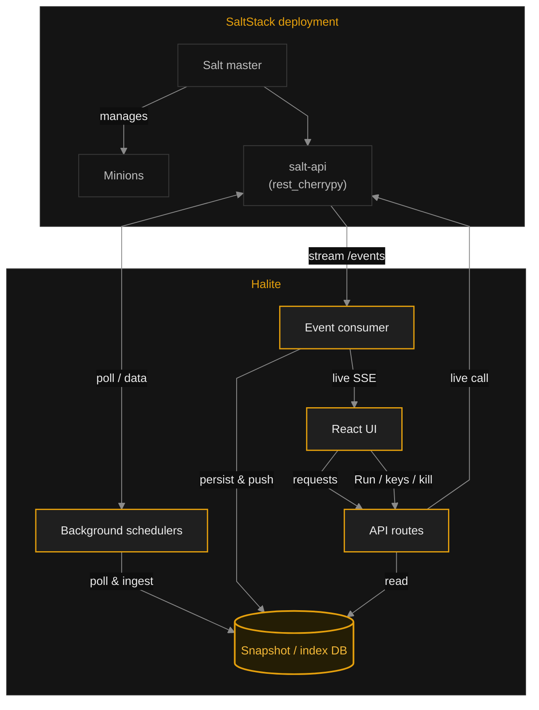

Halite is a read/console layer that sits on top of a running SaltStack master. It communicates exclusively with salt-api's `rest_cherrypy` endpoint — it never connects to the Salt master directly. Your Salt master orchestrates your minions; Halite gives you a web UI to observe and act on that fleet.

## Topology

Halite ingests Salt data two ways: **background schedulers poll** salt-api on a timer (the bulk of the data), and an optional **event consumer streams** the Salt event bus live (the [Activity](/features/activity) feed). Both write into the database; routes read from it. Live Salt calls are reserved for **actions** — running a command, accepting or rejecting a key, or killing a job.

## Poll-into-DB, serve-from-DB

Salt-API can be slow or temporarily unavailable. To stay fast and resilient, Halite uses a **poll-into-DB** model:

1. Background schedulers periodically call Salt-API and **ingest** the results into snapshot and index tables.
2. API routes serve data from those tables — reads are fast database queries, not live Salt calls.

Each feature that uses polling follows the same shape:

- `scheduler.py` — a periodic task owned by `RuntimeConfig`
- `ingest.py` — reconciles a snapshot table against fresh Salt data (insert new rows / update changed rows / delete vanished rows)
- Model files — the SQLAlchemy snapshot or index tables
- `service.py` + `routes.py` — query the snapshot and serve it

For example, the minions ingest (`minions/ingest.py`) calls `wheel.key.list_all` to reconcile key status, `runner.manage.present` to update online presence, and `runner.cache.grains` to refresh grain data — all stored in `minion_snapshots`. The jobs ingest (`jobs/ingest.py`) calls `runner.jobs.list_jobs` with a time-windowed `start_time` and upserts rows into `jobs_index`.

## The live event stream

Polling captures state, but not the moment something changes. To give the [Activity](/features/activity) feed real-time fidelity, Halite adds a second ingestion mode that is **push-based** rather than poll-based.

When the event stream is enabled in [Settings](/features/settings#event-stream), `RuntimeConfig` starts an **event consumer** (`activity/consumer.py`) that holds a long-lived connection to salt-api's `/events` SSE endpoint and tails the Salt event bus:

1. The consumer reads raw events as they happen and **normalizes** the ones it cares about (`activity/normalize.py`) — job dispatches and returns, key accept/reject/delete/pend, and minion starts. Everything else is dropped.
2. Each normalized event is **persisted** to the `activity_events` table and **published** to an in-process `EventHub` (`activity/hub.py`) — a ring buffer plus a set of subscriber queues.
3. Browsers subscribe to `GET /api/activity/stream`, an SSE endpoint that replays the recent ring buffer on connect, then forwards new events live (with a 20-second keepalive). The frontend uses each event to invalidate the matching TanStack Query caches, so the Jobs, Keys, and Minions pages refresh in near real-time too.

The consumer prunes events older than the configured retention window (default 30 days) and reconnects with exponential backoff if the stream drops.

<Note>
  The event bus carries the salt-api auth token as a `?token=` query parameter. Browsers cannot set custom headers on an `EventSource`, and the bare `X-Auth-Token` header returns a flaky 401 on first connect, so Halite authenticates the upstream `/events` connection via the query param.
</Note>

The `EventHub` assumes a **single worker** — its ring buffer and subscriber queues are coordinated by the async event loop, not locks. Run Halite as a single uvicorn worker (the default) so every SSE subscriber sees every event.

## RuntimeConfig — the hub

`RuntimeConfig` (`runtime.py`) owns the single live `SaltAPIClient` and all background schedulers. It is the central coordination point for Salt connectivity.

**At boot**, `RuntimeConfig.boot()` reads the `AppSettings` row from the database. If all three of `salt_api_url`, `salt_api_username`, and the decrypted password are present, it creates a `SaltAPIClient`, logs in immediately to verify the credentials, then starts the schedulers. If the event stream is enabled, it also spins up the `EventHub` and the event consumer. **If any of those credential values are missing, or if the login fails, `runtime.salt` is set to `None` and nothing starts.**

**On a settings change**, the Settings route writes the new values to the database, then calls `runtime.reload(db)`. `reload()` tears down all running schedulers, the event consumer, and the existing client atomically, then rebuilds them from the updated row — so toggling the event stream on or off takes effect with no process restart.

<Note>
  Routes never hold a direct reference to the salt client. They call `salt_client_or_503(request)` from `salt/deps.py`, which always reads the current `runtime.salt`. This makes hot-reloads transparent to in-flight requests.
</Note>

## Graceful degradation

When Salt is unconfigured or unreachable, Halite does not crash — it degrades gracefully:

- Salt-backed **read** endpoints return empty data (the snapshot tables are simply empty).
- Salt-backed **action** endpoints (`run/`, `keys/` accept/reject, kill job) return **HTTP 503** via `salt_client_or_503()`.
- The `wrap_salt_errors()` helper in `salt/deps.py` translates `SaltAPIUnavailable` (network/DNS/TLS errors) into 503 and `SaltAPIError` (non-2xx responses from salt-api) into 502.

This means you can deploy Halite, create users and roles, and explore the UI before your Salt credentials are configured. Visit [Settings](/features/settings) to connect it to your Salt master.

## SaltAPIClient internals

`SaltAPIClient` (`salt/client.py`) is an async client built on `httpx`. A few design decisions worth knowing:

- **Lazy login with concurrency safety** — the first real request triggers a login. An `asyncio.Lock` ensures that N concurrent requests with an expired token trigger exactly one re-login, not N.
- **Token proactive refresh** — the token is refreshed when fewer than 60 seconds remain on it, rather than waiting for a 401.
- **5xx retries** — transient 5xx responses are retried up to 3 times with exponential backoff (base 0.5 s, max 4 s). 401 responses are retried once after a forced re-login.
- **Helpers** — `wheel_call`, `local_call`, `runner_call`, and `list_connected_minions` cover all the Salt client types Halite uses.

## Related pages

- [Settings](/features/settings) — configure the Salt-API connection, poller intervals, and event stream
- [Activity](/features/activity) — the live event feed built on the stream
- [RBAC & Permissions](/concepts/rbac) — how Halite controls who can do what
- [Audit Logging](/concepts/audit-log) — how every action is recorded
