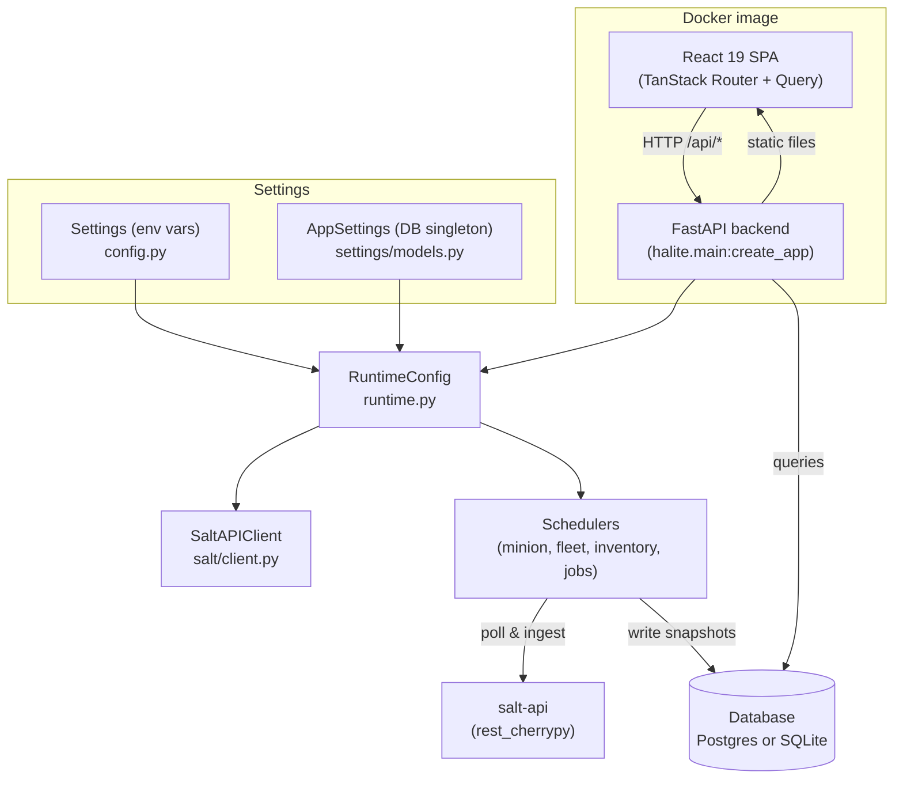

Halite is a FastAPI backend paired with a React 19 SPA, shipped as **one Docker image**. The backend serves the compiled SPA via `HALITE_STATIC_DIR`; there is no separate web server.

## Layers at a glance



## Two kinds of settings

Halite has two separate settings systems that serve different purposes:

| | `Settings` | `AppSettings` |
|---|---|---|
| **Source** | Environment variables | Single DB row |
| **File** | `backend/src/halite/config.py` | `backend/src/halite/settings/models.py` |
| **Covers** | Database URL, cookie secret, listen host/port, log level | Salt-API URL, eauth, username, encrypted password, poller intervals |
| **Editable** | At deploy time | At runtime via the Settings UI |
| **Read** | On process start | On `RuntimeConfig.boot()` and `RuntimeConfig.reload()` |

**Infra settings** (`Settings`) are read-only at runtime. Changing them requires redeploying or restarting the process.

**App settings** (`AppSettings`) are the single row in the `app_settings` table. The salt password is encrypted at rest via `settings/crypto.py`. When you save new credentials through the UI, the settings route writes the row and calls `runtime.reload(db)` — no restart needed.

## RuntimeConfig — the hub

`RuntimeConfig` (`runtime.py`) is the central coordination object. It owns exactly **one** `SaltAPIClient` and all background schedulers.

**At boot**, the lifespan handler calls `RuntimeConfig.boot(db)`, which:
1. Reads the `AppSettings` row.
2. Decrypts the salt password.
3. If all three of `salt_api_url`, `salt_api_username`, and password are present, creates a `SaltAPIClient` and calls `login()` to verify the credentials immediately.
4. Starts whichever schedulers have non-zero intervals configured.

**If any credential is missing, or if the login fails, `runtime.salt` is `None` and no schedulers start.** Every salt-backed endpoint degrades gracefully (503 or empty data) rather than crashing.

**On a settings change**, `runtime.reload(db)` tears down all running schedulers and the existing client atomically, then rebuilds them from the updated row.

```python
# Routes never hold a direct reference to the salt client.
# They call salt_client_or_503(request), which always reads
# the current runtime.salt — making hot-reloads transparent.
client: SaltAPIClient = salt_client_or_503(request)
```

The four schedulers `RuntimeConfig` manages are:

- `MinionStateScheduler` — syncs key status, presence, and grains into `minion_snapshots`
- `FleetIngestScheduler` — builds the fleet compliance picture
- `InventoryScheduler` — populates the inventory index
- `JobsIndexScheduler` — upserts recent jobs into `jobs_index`

## App entry point

`main.py::create_app` is a **factory function** — there is intentionally no module-level `app` object. Importing the module must never read environment variables (that would break tests), so `Settings()` is only constructed inside the factory.

Uvicorn launches it with the `--factory` flag:

```sh
uvicorn halite.main:create_app --factory --reload --host 127.0.0.1 --port 8080
```

The lifespan handler runs in this order on startup:
1. `init_engine(settings.database_url)` — creates the SQLAlchemy async engine.
2. `seed_builtin_roles(s)` — ensures the built-in `admin` and `viewer` roles exist.
3. `bootstrap_admin(s)` — creates the admin user from `BOOTSTRAP_ADMIN_*` env vars if it does not already exist.
4. `RuntimeConfig.boot(db)` — wires up the salt client and schedulers.

When `settings.static_dir` is set (i.e., `HALITE_STATIC_DIR` is configured), the SPA build is mounted. A catch-all route returns `index.html` for client-side routes; real static files (favicon, touch icon, robots.txt) are served first so browsers get the correct content type.

## Related pages

- [How Halite Works](/concepts/how-it-works) — the poll-into-DB pattern and graceful degradation
- [Backend](/develop/backend) — feature modules, SaltAPIClient, and RBAC
